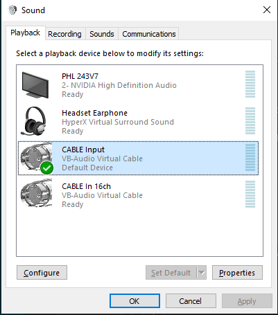
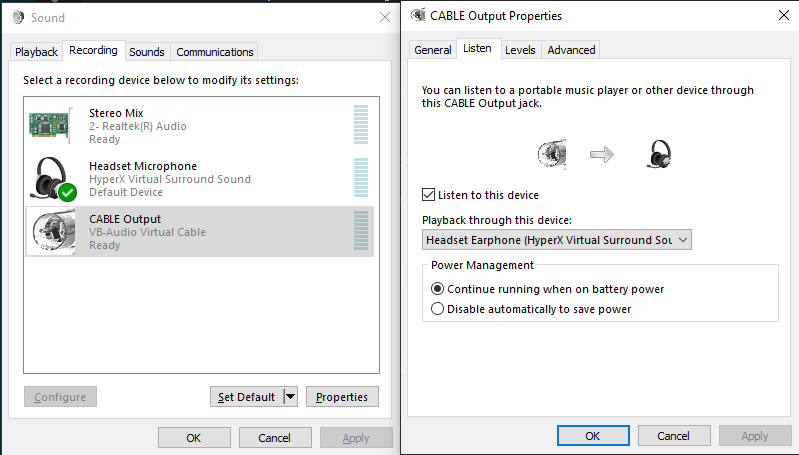
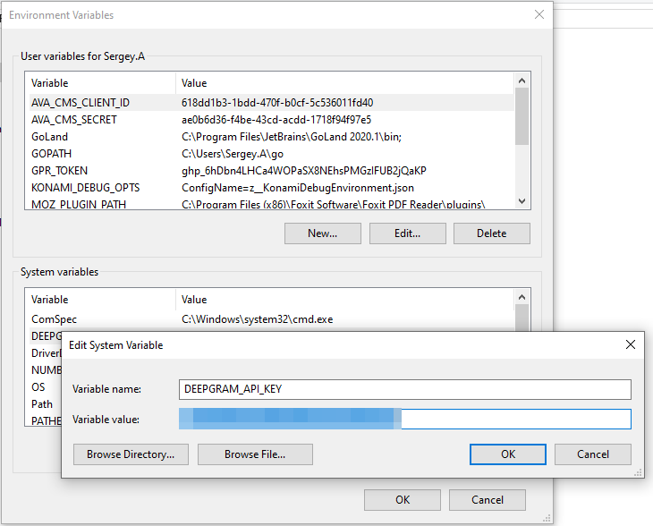
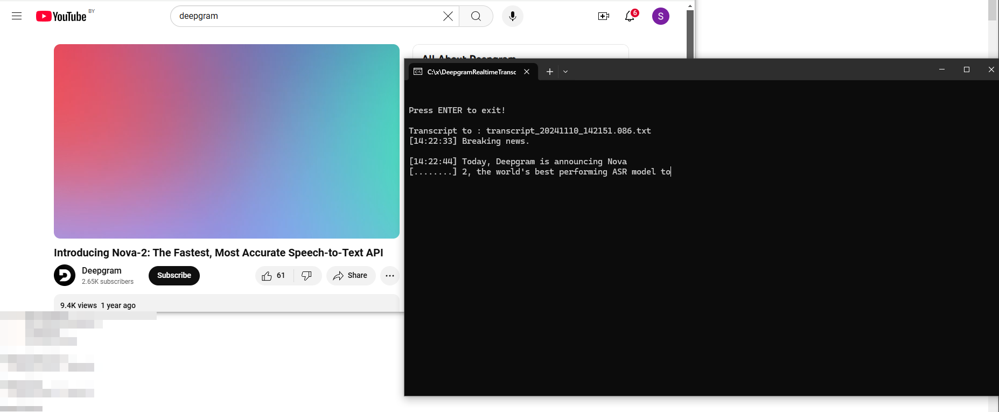

# DeepgramOnlineTranslator
Translate audio from Stero Mix/CABLE Output device in realtime

Based on examples from https://github.com/deepgram/deepgram-go-sdk

This tool can be useful if you have issues with listening skills and so want to online transcribe meetings with you colleagues in Google Meet/Zoom/Skype/whatelse or have realtime subtitles for any vide played on your PC.

You need to configure not default input sound device that grab default output device sound and specify it in source code, somewhere near `microphone.AudioConfig`

So configuration should be next:

1. default output device for example 'Headset XXX'
2. default input device for example 'Headset XXX Microphone'

these devices will be used for communicate in meeting.

3. input device that copy sound from default output device.
   usually it is Stereo Mix device, but for some reason it was not works on my PC, so I install virtual audio cable (https://vb-audio.com/Cable/index.htm) and setup it in next way:
   a. make CABLE Input as default playback device
   b. left default input device as microphone of my headset
   c. configure CABLE Output device to playback through Headset earphone




4. Register on Deepgram.com and create key

5. Add env variable DEEPGRAM_API_KEY



4. Start application and join meeting/play movie


## Build

I have some difficulties with building, so here is instruction how to do it on Windows

1. Setup MSYS2 (https://www.msys2.org/)

2. Run msys2 console and update msys2, install gcc, pkg-config and portaudio
```bash
pacman -Syu
pacman -Su
pacman -S mingw-w64-x86_64-gcc
pacman -S mingw-w64-x86_64-pkg-config
pacman -S mingw-w64-x86_64-portaudio
```

3. Add path to bin with gcc to PATH
In my case it was `C:\msys64\mingw64\bin`

Try execute in started console `gcc` to see if PATH is ok. Try reboot if path not applied.

4. Find in `main.go` line where device name specified, and change it to your device.

```go
	DeviceNameRx:  `CABLE\s*Output`,
```

Note - it is regular expression.

5. In console go to sources directory root and build with enabled cgo
```sh
set CGO_ENABLED=1
go build .
```

It shoud produce `DeepgramOnlineTranslator.exe`